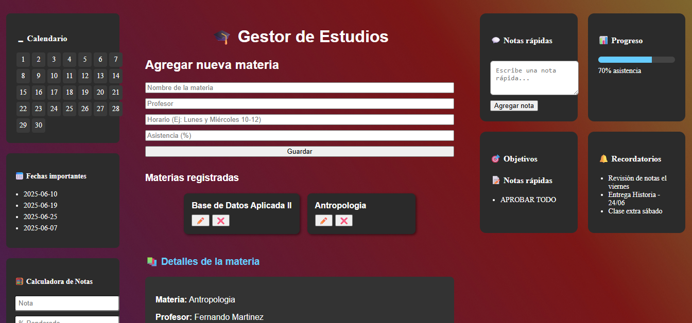

# 📚 Gestor de Estudios

Aplicación web desarrollada con **React** para organizar y visualizar materias, notas, asistencia, recordatorios y más. Ideal para estudiantes que buscan centralizar su vida académica en una interfaz clara e intuitiva.

---

## 🖼️ Captura de pantalla

---

## 🚀 Funcionalidades principales

- 📘 Registro de materias con información de profesor, horario y asistencia.
- 🧾 Carga y visualización de notas por materia.
- 🧮 Calculadora de notas ponderadas con porcentajes personalizados.
- 📊 Visualización del progreso académico mediante una barra de asistencia.
- 📅 Calendario interactivo para marcar fechas importantes.
- 🔔 Sección de recordatorios y notas rápidas.
- 🎯 Panel de objetivos con opción de marcarlos como completados.

---

## 🛠️ Tecnologías utilizadas

- ⚛️ React para la interfaz.
- 🔥 Firebase (Firestore) para almacenamiento y sincronización en tiempo real.
- 📆 date-fns para manejo de fechas.

---

## 🧪 Instalación local

1. **Clonar el repositorio**

bash
git clone https://github.com/AllanMartinezC/gestor-estudios-react.git
cd gestor-estudios-react
npm install

Configurar Firebase

Crear un proyecto en Firebase Console

Activar Firestore.

Reemplazar la configuración en firebase/config.js con los datos del proyecto.

Iniciar el servidor local

bash
npm run dev

📌 Estado del proyecto
✅ Funcional

🚧 Posibles mejoras: autenticación, historial de cambios, exportación de datos.

📄 Licencia
Este proyecto está bajo la licencia MIT.

✨ Autor
Desarrollado con 💻 por Allan Martinez
